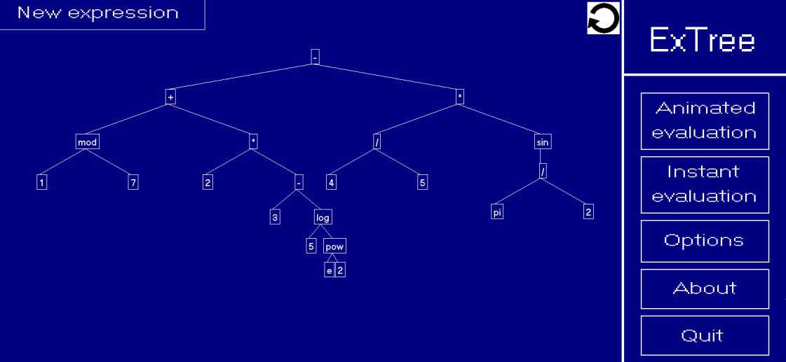

# About 

ExTree is an expression tree visualizer and evaluator.

# License 

ExTree was created by [Constantin Mihai](https://github.com/UnexomWid) and [Adrian Petercă](https://github.com/adipeterca), first-year students of the Faculty of Computer Science Iași (group B5, 2019-2020).

This project is licensed under the [MIT](https://github.com/UnexomWid/ExTree/blob/master/LICENSE) license.

# Compiler and Dependencies

This project was compiled using **GNU GCC**, and was written for the Windows operating system. Therefore, it _will not work_ on Linux.

The dependencies are as follows:

* [Windows API](https://en.wikipedia.org/wiki/Windows.h)
* [WinBGIm](https://www.cs.colorado.edu/~main/bgi/)

# ExTree

  

ExTree supports all Visual Basic functions and operators, as well as variables and constants.

## Supported functions

For a complete list of supported functions, click [here](https://docs.microsoft.com/en-us/dotnet/visual-basic/language-reference/functions/math-functions).

## Supported operators

The supported constnats are as follows:

| Identifier |          Name         |
|:----------:|:---------------------:|
|      +     |        Addition       |
|      -     |      Subtraction      |
|      /     |    Integer Division   |
|      *     |     Multiplication    |
|     <>     |       Not Equal       |
|      =     |         Equal         |
|      <     |      Smaller than     |
|     <=     | Smaller than or Equal |
|      >     |      Larger than      |
|     >=     |  Larger than or Equal |
|     or     |       Bitwise OR      |
|     and    |      Bitwise AND      |
|     xor    |      Bitwise XOR      |
|     not    |      Bitwise NOT      |
|     mod    |        Modulus        |
|      \     |     Float Division    |

## Supported constants

The supported constnats are as follows (_case insensitive_):

|  Name |                 Value                 |
|:-----:|:-------------------------------------:|
|  True |                   1                   |
| False |                   0                   |
|   PI  | 3.14159265358979323846264338327950288 |
|   E   |         2.71828182845904523536        |

## Evaluation

There are 2 evaluation types:

* Instant Evaluation: the expression is evaluated instantly
* Animated Evaluation: the expression is evaluated step-by-step

You can choose whichever type you want from the menu.

If the expression contains variables, you must first enter a value for each value before the expression can be evaluated.

_Syntax and evaluation errors are automatically detected. In case there is a syntax error, the program will show the index at which the error occurred._

Once the expression has been evaluated, you must click the _back arrow_ to restore the tree to its original state.

## Themes and languages

ExTree supports 4 languages (**English**, **Romanian**, **French** and **German**), and comes with 3 built-in themes (**blue**, **green** and **pink**).

## Moving the Tree

If the expression tree is too big, is possible to move it by using the _arrow keys_.
